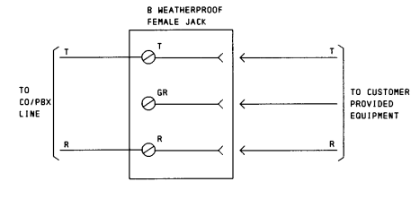
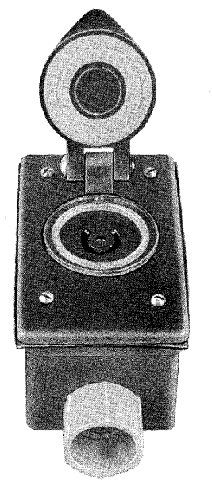
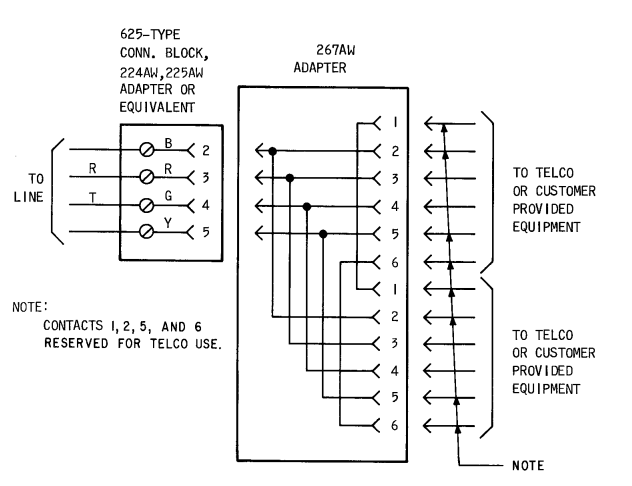
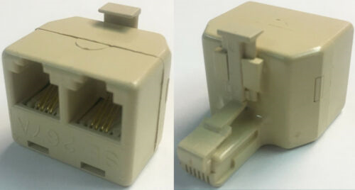
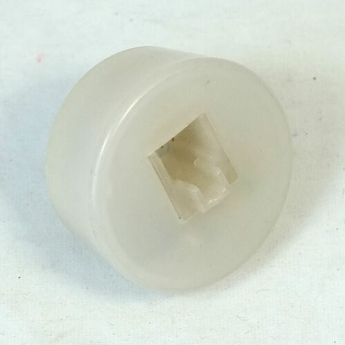
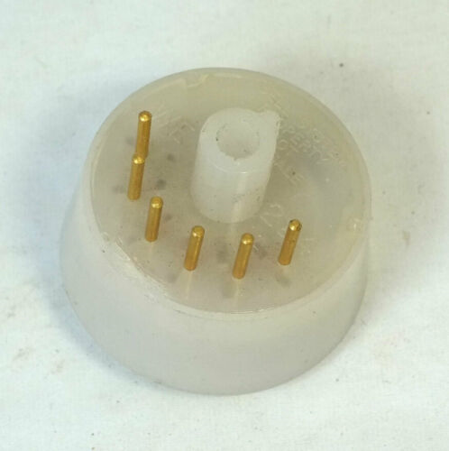
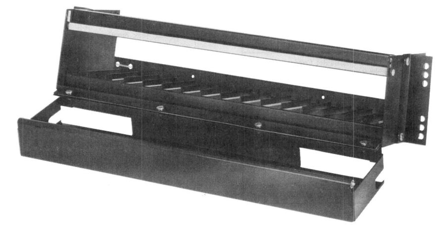
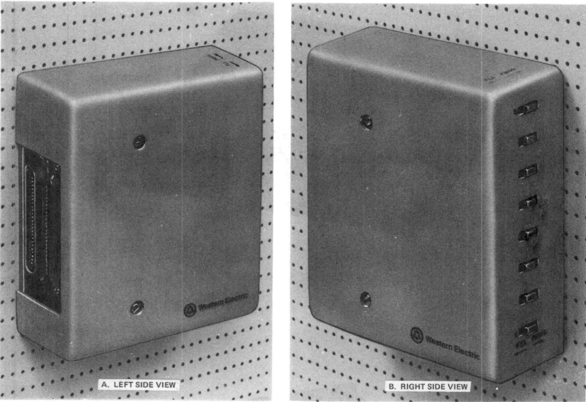

# List of Jacks

## Registered Jack (RJ)

| USOC | Name | Description | Other codes | Connections | Image |
| -- | -- | -- | -- | -- | -- |
| RJ11C | Bridged T/R; 6-position jack |
| RJ11W | Bridged T/R; 6-position jack |
| RJ14C | Bridged T/R; 6-position jack |
| RJ14W | Bridged T/R; 6-position jack |
| RJ15C | Bridged T/R; 3-position weatherproof jack | | |  |  |
| RJ18C | Bridged T/R with make-busy arrangement; 6-position jack |
| RJ18W | Bridged T/R with make-busy arrangement; 6-position jack |

## Registered Jack Adapter (RJA)

| USOC | Name | Description | Other codes | Connections | Image |
| -- | -- | -- | -- | -- | -- |
| `RJA1X` | Adapter between non-standard square-array 4 pin jack and standard 6 position plug | 4 prong jack (male) to 6P4C modular jack (female) | `225A`, `225AW` | |   |
| `RJA2X` | Adapter between one standard 6 position jack and two standard position plugs ("cube tap" or "T" adapter) | 6P4C modular jack (male) to two 6P4C modular jacks (female) | `267A`, `267AW` |  |  |
| `RJA3X` | Adapter between non-standard 12 pin jack and standard 6 position plug | 12-pin jack (male) to 6P4C modular jack (female) | `224A`, `224AW` | |   |
| `RJA4X` | Adapter between non-standard retangular-array 6 pin jack and standard 6 position plug | | |
| `RJA5X` | | | | | |

## Registered Jack Mount (RJM)

| USOC | Name | Description | Other codes | Connections | Image |
| -- | -- | -- | -- | -- | -- |
| `RJM2X` | | | | |  |
| `RJM3X` | | | | |  |
| `RJM4X` | | | | | |

*It seems that `RJM1X` does not exist.*