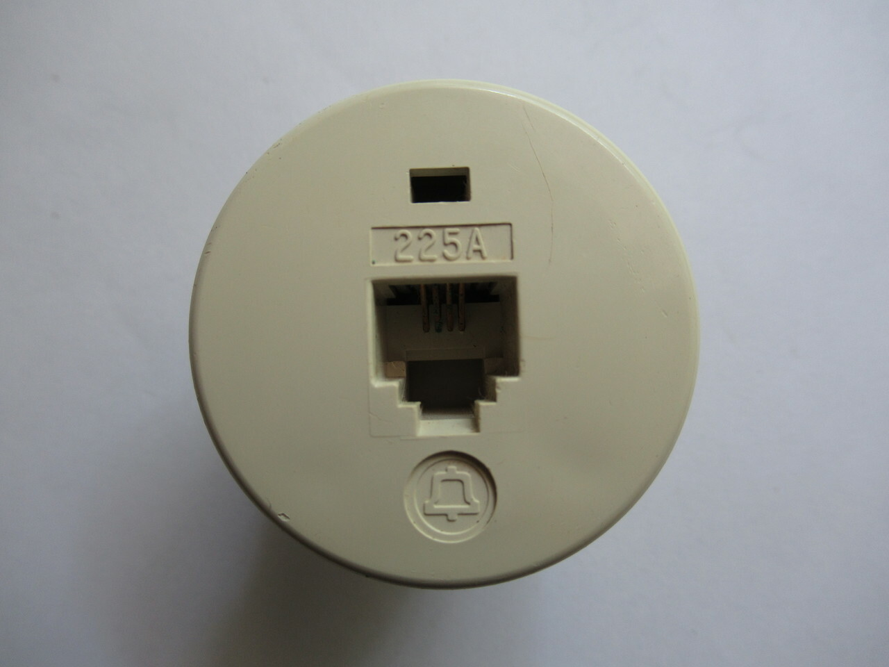
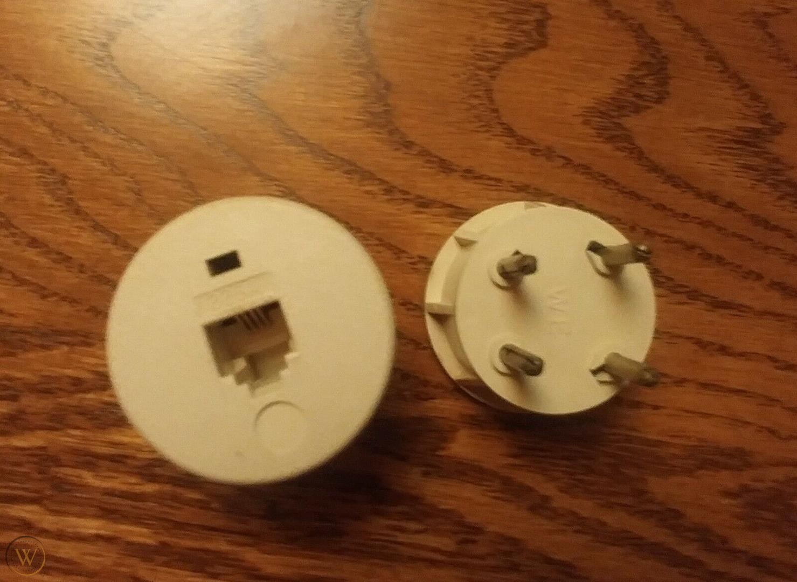

# List of Jacks

## Registered Jack (RJ)

*TODO*

## Registered Jack Adapter (RJA)

| USOC | Name | Description | Other codes | Image |
| -- | -- | -- | -- | -- |
| `RJA1X` | | | `225A`, `225AW` |   |
| `RJA2X` | | |
| `RJA3X` | | |
| `RJA4X` | | |
| `RJA5X` | | |

## Registered Jack Mount (RJM)

| USOC | Description | Image |
| -- | -- | -- |
| `RJM2X` | | |
| `RJM3X` | | |
| `RJM4X` | | |

*It seems that `RJM1X` does not exist.*