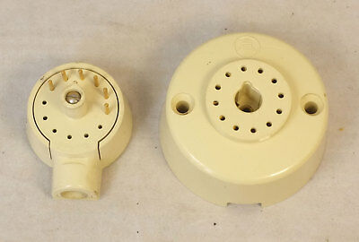

# List of Jacks

## Registered Jack (RJ)

*TODO*

## Registered Jack Adapter (RJA)

| USOC | Name | Description | Other codes | Image |
| -- | -- | -- | -- | -- |
| `RJA1X` | | 4 prong jack (male) to 6P4C modular jack (female) | `225A`, `225AW` |   |
| `RJA2X` | | 6P4C modular jack (male) to two 6P4C modular jacks (female) | `267A`, `267AW` |  |
| `RJA3X` | | 12-pin jack (male) to 6P4C modular jack (female); second image shows the 12-pin plug and jack positioning | `224A`, `224AW` |   |
| `RJA4X` | | |
| `RJA5X` | | |

## Registered Jack Mount (RJM)

| USOC | Description | Image |
| -- | -- | -- |
| `RJM2X` | | |
| `RJM3X` | | |
| `RJM4X` | | |

*It seems that `RJM1X` does not exist.*