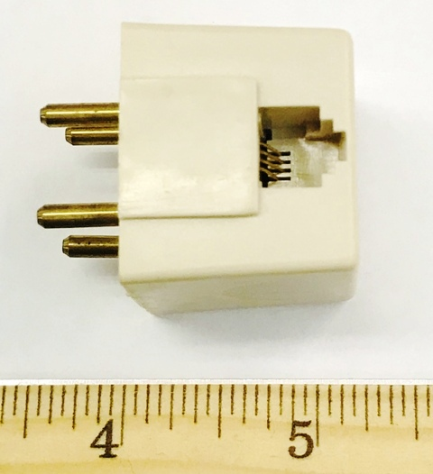

# List of Jacks

## Registered Jack (RJ)

*TODO*

## Registered Jack Adapter (RJA)

| USOC | Description | Image |
| -- | -- | -- |
| RJA1X | |  |
| RJA2X | | |
| RJA3X | | |
| RJA4X | | |
| RJA5X | | |

## Registered Jack Mount (RJM)

| USOC | Description | Image |
| -- | -- | -- |
| RJM2X | | |
| RJM3X | | |
| RJM4X | | |

*It seems that <ins>RJM1X</ins> does not exist.*